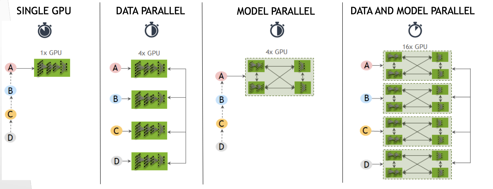

## Multi GPU [출처: 당근마켓-multi-GPU](https://medium.com/daangn/pytorch-multi-gpu-%ED%95%99%EC%8A%B5-%EC%A0%9C%EB%8C%80%EB%A1%9C-%ED%95%98%EA%B8%B0-27270617936b)
--- 
- 여러개의 GPU를 사용하는데 각 GPU마다 memory 사용량이 다른 문제가 발생할 수 있다.
- 하나의 GPU를 사용해서 학습하는 경우보다 그닥 학습이 빨라지지 않는 경우도 많다.
- 제대로 사용하자
---
- Pytorch에서 Data Parallel이라는 기능 제공
- 1) 모델을 각 GPU에 복사해서 할당
- 2) 매 iteration 마다 batch를 GPU의 개수만큼 분할(scatter)
- 3) GPU 에서 forward 과정을 진행
- 4) 각 입력에 대해 모델이 출력을 내보내면 이 출력들을 하나의 GPU로 모은다(gather)
- 5) Loss function을 통해 loss를 계산하고 back-propagation
    - back-propagation은 각 GPU에서 수행하며 그 결과로 각 GPU에 있던 모델의 gradient를 구할 수 있음.
    - 만약 4개의 GPU를 사용한다면 4개의 GPU에 각각 모델이 있고 각 모델은 계산된 gradient를 가지고 있음.
    - 모델 업데이트를 위해 GPU에 있는 gradient를 또 하나의 GPU로 모아서 업데이트 진행
    - Adam 같은 경우는 gradient를 모은 다음 추가 연산 이후 업데이트
```python
import torch.nn as nn
model = nn.DataParallel(model)
```
####과정
- replicate -> scatter -> Parallel_apply -> gather 순서로 진행
    - 여기서 gather는 한 GPU에서 각 모델의 출력을 모아주기 때문에 하나의 gpu의 메모리 사용량이 많을 수 밖에 없음.
```python
def data_parallel(module, input, device_ids, output_device):
    replicas = nn.parallel.replicate(module, device_ids)
    inputs = nn.parallel.scatter(input, device_ids)
    replicas = replicas[:len (inputs)]
    outputs = nn.parallel.parallel_apply(replicas, inputs)
    return nn.parallel.gather(outputs, output_device)
```

```python
import torch
import torch.nn as nn
model = BERT(args)
model = torch.nn.DataParallel(model)
model.cuda()
'''
#data loader
'''
for i, (inputs, labels) in enumerate(trainloader):
    outputs = model(inputs)
    loss = criterion(outputs, labels)
    optimizer.zero_grad()
    loss.backward()
    optimizer.step()
```
- [BERT 코드](https://github.com/codertimo/BERT-pytorch)
- 문제점: 하나의 GPU가 상대적으로 많은 메모리를 사용하면 batch size를 많이 키울 수 없다.
- batch size는 학습 성능에 영향을 주는 경우가 많아서 메모리 사용 불균형은 꼭 해결해야할 문제다.
---
#### 해결책
- 간단한 방법: 단순히 출력을 다른 GPU로 모은다. 
    - default(0)로 설정되어 있는 GPU는 gradient 또한 해당 GPU로 모이기 떄문에 다른 GPU에 비해 메모리 사용량이 상당히 많다.
    - 출력을 다른 GPU로 모으면 메모리 사용량의 차이를 줄일 수 있다.
```python
import os
import torch.nn as nn
on.environ["CUDA_VISIBLE_DEVISES"] = '0,1,2,3'
model = nn.DataParallel(model, output_device = 1)
```
- 여전히 제대로 사용하지 못한다. (GPU-Util을 보면)

## Custom으로 DataParallel  사용
- PyTorch-Encoding 패키지
    - GPU의 메모리 사용량이 늘어나는 것은 모델의 출력을 하나의 GPU로 모으는 작업 때문이다.
    - why?) 모델의 출력을 사용해서 loss function을 계산해야하기 떄문이다.
    - solution) loss function 또한 병렬로 연산하도록 만들면 메모리 불균형 문제를 어느정도 해결가능
```python
from torch.nn.parallel.data_parallel import DataParallel

class DataParallelCriterion(DataParallel):
    def forward(self, inputs, *targets, **kwargs):
        targets, kwargs = self.scatter(targets, kwargs, sefl.device_ids)
    replicas = self.replicate(self.module, self.device_ids[:len(inputs)])
        targets = tuple(targets_per_gpu[0] for targets_per_gpu in targets)
        outputs = _criterion_parallel_apply(replicas, inputs, targets, kwargs)
        return Reduce.apply(*outputs) / len(outputs), targets
```
- DataParallelCriterion을 사용 할 경우에 일반적으로 DataParallel로 모델을 감싸면 안된다.
- DataParallel은 기본적으로 하나의 GPU로 출력을 모으기 때문이다.
- 그러므로 Custom DataParallel 클래스인 DataParallelModel을 사용한다
- Pytorch-Encoding 패키지의 parallel.py파일만 가져오면 됨
```python
import torch
import torch.nn as nn
from parallel import DataParallelModel, DataParallerlCriterion
model = BERT(args)
model = DataParallelModel(model)
model.cuda()

criterion = nn.NLLLoss()
criterion = DataParallelCriterion(criterion)

for i, (inputs, labels) in enumerate(trainloader):
    outputs = model(inputs)
    loss = criterion(outputs, labels)
    optimizer.zero_grad()
    loss.backward()
    optimizer.step()
```
## 100%까지 GPU 성능 올리기
- Pytorch에서 Distributed 패키지 사용
- multi-GPU 학습을 할 때도 분산 학습을 사용할 수 있다.
- 하나의 컴퓨터로 학습하는게 아니라 여러 컴퓨터를 사용해서 학습하는 경우를 위해 개발된 것이다. 하지만, multi-GPU 학습을 할 때도 분산 학습을 사용할 수 있다. 분산 학습을 직접 구현할 수도 있지만, pytorch에서 제공하는 기능을 사용할 수도 있다.
    - [tutorial 읽어보기](https://pytorch.org/tutorials/intermediate/dist_tuto.html)
    - 이건 아마 서버가 여러개 있을 때 사용하는 경우이다.
- 여기는 하나 파일 쓰는 경우
    - [ImageNet 예제](https://github.com/pytorch/examples/blob/master/imagenet/main.py)의 main.py에서 multi-GPU 관련 부분 정리
    - main.py를 실행하면 main이 실행되는데 main은 다시 main_worker 들을 multi-processing으로 실행
```python
import torch.distributed as dist
from torch.nn.parallel import DistributedDataParallel

def main():
    args = parser.parse_args()
    ngpus_per_node = torch.cuda.device_count()
    args.world_size = ngpus_per_node * args.world_size
    mp.spawn(main_worker, nprocs = ngpus_per_node, args = (ngpus_per_node, args)

def main_worker(gpu, ngpus_per_node, args):
    global best_acc1
    args.gpu = gpu
    torch.cuda.set_device(args.gpu)
    print("Use GPU: {} for training" . format(args.gpu))
    args.rank = args.rank * ngpus_per_node + gpu
    dist.init_process_group(backend = 'nccl', init_method = 'tcp://127.0.0.1:FREEPORT', world_size=args.world_size, rank=args.rank)
model = Bert()
model.cuda(args.gpu)
model = DistributedDataParallel(model, device_ids = [args.gpu])
acc = 0
for i in range(args.num_epochs):
    model = train(model)
    acc = test(model, acc)
```

# NVIDIA Apex를 사용해서 학습하기
- 보통 딥러닝은 32비트 연산을 하는데 16비트 연산을 사용해서 메모리를 절약하고 학습 속도를 높이겠다는 의도로 만들어 진 것.
- Mixed precision 연산 기능말고도 Distributed 관련 기능이 포함된다.
- Apex의 Distributed DataParallel 기능을 하는 것이 DDP이다. 
    - [Apex](https://github.com/NVIDIA/apex/blob/master/examples/imagenet/main_amp.py)

# Multi-GPU 학습 방법 선택하기
- DataParallel
    - 가장 기본적인 방법이지만 GPU 메모리 분귱형 문제
- Custom DataParallel
    - GPU 메모리 문제를 어느정도 해결해주지만 GPU를 제대로 활용하지 못한다는 문제
- Distributed DataParallel
    - 원래 분산학습을 위해 만들어진 pytorch 기능이지만 multi-GPU학습에도 사용할 수 있고 메모리 분균형 문제와 GPu를 활용하지 못하는 문제가 없엄음
    - 간간히 문제들이 발생할 수 있음.
- Nvidia Apex
    - Nvidia에서 만든 Apex를 이용해서 multi-GPU 학습
    - 이미지 같은 경우는 DataParallel 만으로 출분할 수 있다.(모델 자체가 클수는 있어도 모델 출력은 그렇게 크지 않음)
    - BERT에서 GPU메모리 불균형 문제가 생기는 이유는 모델 출력이 상당히 크기 때문이다.
    - 각 step마다 word의 개수만큼이 출력으로 나오기 때문에 이런 문제가 생긴다.
---
# NVIDIA AI conference


- 모델 설계 단계부터 multiGPU 구현
    - 데이터가 큰 경우
    - 학습시간이 오래 걸리는 경우
    - 모델 구현 단계에 검증 작업이 빈번하게 발생시 시간절약
    - 규모있는 문제 도전 가능
    - Google's GNMT, Transformer, BERT, GPT-2,XLNet
    - GLOW, PGGAN, StyleGAN, WaveGlow

- Template for New Project
    - 신규 프로젝트 작업시 
        - Model, Data Loader, Train script 분리
```
pytorch
    requirement.txt
    Dockerfile
    README.md
    train.py
    model.py
    inference.py
    config.json
    modules
        my_layers.py
        SpecAug.py
    utils
        audio_processing.py
        data_utils.py
    scripts
        dataset.sh(shell)
```
- 예시: NV-Tacotron2
- NV-wavenet
- WaveGlow

접근 방법
- PYTORCH DataParalle(DP)
- PYTORCH Distributed Data Paralle(DDP)
    - synchronize gradients, parameters and buffers
- horovod-pytorch
- APEX (NVIDIA custom DDP)

```python
import torch.distributed as dist
from torch.nn.parallel import DistributedDataParallel as DDP
from torch.nn import DataParallel as DP

if args.distributed:
    if args.gpu is not None:
        torch.cuda.set_device(args.gpu)
        model.cuda(args.gpu)
        args.batch_size = int(args.batch_size/ngpus_per_node)
        args.workers = int(args.workers/ngpus_per_node)
        model = DDP(model, device_ids = [args.gpu])
    else:
        model.cuda()
        model = DDP(model)
else:
    model.cuda()
    model = DP(model)
```

[NVIDIA refe](https://ngc.nvidia.com/catalog/model-scripts?orderBy=modifiedDESC&pageNumber=1&query=&quickFilter=&filters=)

---
[https://blog.naver.com/laonple/220667260878](https://blog.naver.com/laonple/220667260878)
#### GPU
- Why GPU?
    - 연산량!
    - convolutional layer: 전체 연산량의 90~95%를 차지하지만, free parameter개수는 5%
    - Fully connected layer: 전체 연산량의 5~10%를 차지하지만, gree parameter개수는 95%
- convolutional layer는 픽셀의 위치를 옮기면서 matrix-multiplication을 진행하므로 연산 개수가 매우 많다.
    - 이는 아무 좋은 병렬적인 특징(parallelism)을 갖는다.
- Conveolutional layer
    - 여러 개의 입력 feature-map으로 부터 여러개의 filter 연산을 수행하기 때문에 높은 수준의 data parallelism이 존재 
    - Data parallelism: each worker trains the same convolutional layers on a different data batch.
- FC
    - Model parallelism: all workers train on same batch; workers communicate as frequently as network allows


---
#### BASIC tutorial
- DistributedDataParallel(DDP): 모듈레벨에서 데이터 병렬화를 실행하는 것이다.
- synchronize gradients, parameters, and buffers
- Parallelism is available within a process and across processes.

#### DataParallel
```python
device = torch.device('cuda:0')
```
```python
import torch
import torch.nn as nn

def DataParallelModel(nn.Module):
    def __init__(self):
        super().__init__()
        self.block1 = nn.Linear(10,20)
        self.block2 = nn.Linear(20,20)
        self.block2 = nn.DataParallel(self.bloack2)
        self.block3 = nn.Linear(20,20)
    
    def forward(self, x):
        x = self.block1(x)
        x = self.block2(x)
        x = self.block3(x)
        return x
```
- Primitives on which DataParallel is implemented upon
    - replicas = 
```python

```

---
- CPU: 코어 개수 보다는 단일 쿨럭이 높아야함
- RAM: 다다익램
- GPU: 메모리 클수록, 코어가 많고 쿨럭이 높을수록 빠르다. badwidth도 중요.